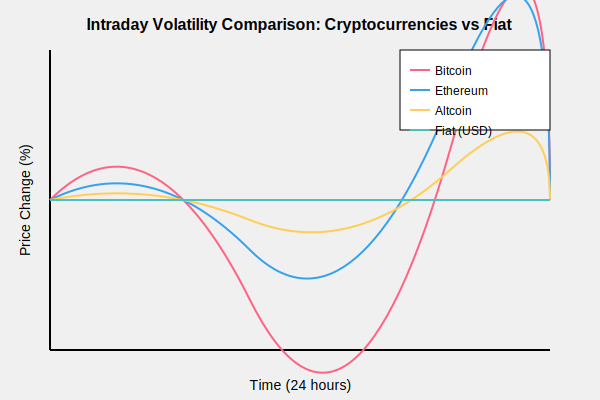
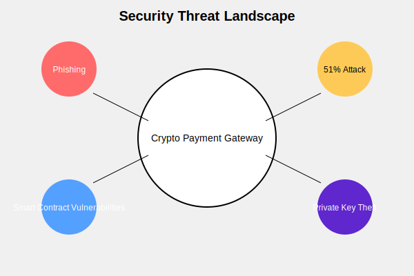
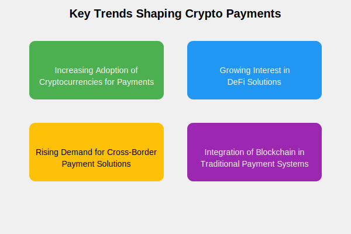
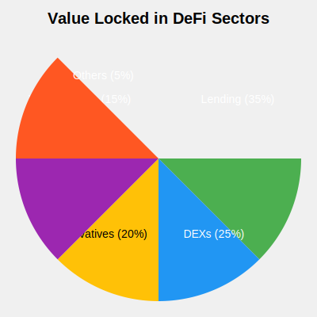
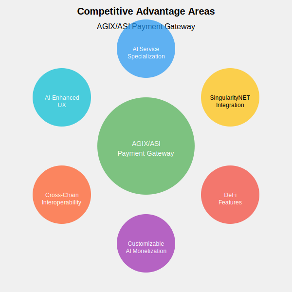

# Market Research

## Crypto Payment Gateways for AI-Enabled SaaS Products

## Introduction

In the rapidly evolving landscape of artificial intelligence and blockchain technology, the need for specialized payment solutions has become increasingly apparent. This research delves into the world of cryptocurrency payment gateways, with a particular focus on their potential application for AI-enabled Software as a Service (SaaS) products within the SingularityNET ecosystem.

As we explore the existing market, key features, challenges, and trends, we aim to identify opportunities for creating a unique AGIX/ASI payment gateway. This gateway will not only facilitate transactions using SingularityNET's native tokens but also address the specific needs of AI developers and users on the platform.

Our research will provide valuable insights to guide the development of a payment solution that enhances the SingularityNET marketplace, empowers developers to monetize their AI services effectively, and contributes to the growth of the ecosystem as a whole.

## 1. Existing Solutions

To understand the current state of the crypto payment gateway market, we'll examine four prominent players: BitPay, Coinbase Commerce, CoinPayments, and BTCPay Server. Each of these solutions offers unique features and caters to different market segments.

### BitPay

BitPay stands as one of the pioneers in the crypto payment processing industry. Founded in 2011, it has established itself as a reliable solution for businesses looking to accept cryptocurrency payments.

Key Features:

- Supports multiple cryptocurrencies, including Bitcoin, Ethereum, and several stablecoins
- Offers instant conversion to fiat currencies, protecting merchants from volatility
- Provides plugins for popular e-commerce platforms like Shopify and WooCommerce
- Complies with regulatory requirements in multiple jurisdictions

### Coinbase Commerce

Launched by the well-known cryptocurrency exchange Coinbase, Coinbase Commerce offers a seamless solution for merchants to accept crypto payments.

Key Features:

- Easy integration with existing e-commerce platforms
- Supports major cryptocurrencies like Bitcoin, Ethereum, and Litecoin
- Provides a hosted checkout page for simplified implementation
- Offers detailed transaction reporting and analytics

### CoinPayments

CoinPayments distinguishes itself by supporting a vast array of cryptocurrencies, making it an attractive option for businesses catering to diverse crypto communities.

Key Features:

- Supports over 2,000 cryptocurrencies
- Offers plugins for various e-commerce platforms and content management systems
- Provides a multi-coin wallet for easy management of different cryptocurrencies
- Features atomic swaps for instant conversion between supported coins

### BTCPay Server

As an open-source, self-hosted payment processor, BTCPay Server offers a unique proposition for businesses that prioritize control and privacy.

Key Features:

- Self-hosted solution, giving merchants full control over their payment processing
- No fees (beyond standard network transaction fees)
- Supports Bitcoin and several other cryptocurrencies
- Highly customizable with a strong focus on privacy and security

By analyzing these existing solutions, we can identify gaps in the market and opportunities for our AGIX/ASI payment gateway to differentiate itself, particularly in serving the unique needs of AI-enabled SaaS products on the SingularityNET platform.

## 2. Key Features

To create a competitive and effective payment solution for AI-enabled SaaS products, it's crucial to understand the key features that define successful crypto payment gateways. These features address the unique challenges of cryptocurrency transactions and cater to the needs of both merchants and customers.

### 2.1 Multi-currency Support

In the diverse world of cryptocurrencies, supporting multiple tokens is essential for broad market appeal.

- Allows merchants to accept various cryptocurrencies, expanding their potential customer base
- Provides flexibility for customers to pay with their preferred digital assets
- Typically includes support for major cryptocurrencies (Bitcoin, Ethereum) and popular altcoins

### 2.2 Volatility Protection

Cryptocurrency price fluctuations can pose risks for merchants. Volatility protection features mitigate these risks.

- Instant conversion to fiat currencies upon transaction completion
- Protects merchants from potential losses due to rapid price changes
- Some gateways offer options to hold crypto or convert to stablecoins

### 2.3 Integration with Existing E-commerce Platforms

Seamless integration capabilities are crucial for widespread adoption.

- Plugins or modules for popular e-commerce platforms (e.g., Shopify, WooCommerce, Magento)
- Easy-to-implement checkout solutions for websites and mobile apps
- Support for both online and point-of-sale (POS) systems

### 2.4 Regulatory Compliance

As the crypto space matures, adherence to regulations becomes increasingly important.

- KYC (Know Your Customer) and AML (Anti-Money Laundering) procedures
- Compliance with local and international financial regulations
- Regular audits and transparency reports

### 2.5 Security Features

Robust security measures are paramount in protecting both merchants and customers.

- Multi-signature (multi-sig) wallets for enhanced transaction security
- Cold storage solutions for long-term fund storage
- Two-factor authentication (2FA) for account access
- Encryption of sensitive data

### 2.6 API Access for Custom Integrations

Flexibility in integration is key for businesses with unique needs or custom-built platforms.

- Comprehensive API documentation
- SDKs (Software Development Kits) for popular programming languages
- Webhooks for real-time notifications and automated processes

### 2.7 Transaction Monitoring and Reporting

Detailed insights into payment activities are crucial for business operations and compliance.

- Real-time transaction monitoring
- Customizable reports for financial reconciliation
- Analytics dashboard for tracking payment trends and customer behavior
- Export capabilities for integration with accounting software

By incorporating these key features, a crypto payment gateway can provide a robust, secure, and user-friendly solution for service providers. For our AGIX/ASI payment gateway, we'll need to consider how these features can be tailored specifically for AI-enabled SaaS products on the SingularityNET platform, potentially introducing innovative features that cater to the unique needs of AI developers and users.

## 3. Challenges

While crypto payment gateways offer numerous benefits, they also face several significant challenges. Understanding these obstacles is crucial for developing a robust AGIX/ASI payment solution for the SingularityNET ecosystem.

### 3.1 Regulatory Uncertainty in Different Jurisdictions

The regulatory landscape for cryptocurrencies varies significantly across the globe, presenting both challenges and opportunities for payment gateways.

Advantages:

**Regulatory Arbitrage**: Some jurisdictions offer more favorable regulations, allowing for innovative solutions.

**First-Mover Advantage**: In regions with developing regulatory frameworks, early entrants can help shape policies.

**African Market Opportunity**: Many African countries have a more open stance towards cryptocurrencies, presenting unique advantages:

  - Financial Inclusion: Crypto payments can serve the large unbanked population in Africa.
  - Remittance Market: Lower fees for international transfers compared to traditional methods.
  - Leapfrogging Legacy Systems: African nations can adopt cutting-edge blockchain technology without the burden of outdated financial infrastructure.

Disadvantages:

**Compliance Costs**: Adhering to diverse regulations across multiple jurisdictions can be expensive.

**Legal Risks**: Uncertain or changing regulations may lead to unexpected legal challenges.

**Market Fragmentation**: Different rules in various countries can limit the ability to offer standardized services globally.

### 3.2 Volatility of Cryptocurrency Prices

Rapid price fluctuations in cryptocurrencies pose significant risks for both merchants and customers.

- **Challenge**: Potential for significant value changes between the time of transaction and settlement.
- **Impact**: May discourage merchants from holding cryptocurrencies, limiting long-term adoption.
- **Solutions**: Implementing instant fiat conversions or stablecoin options to mitigate volatility risks.

### 3.3 Transaction Speed and Scalability Issues

The scalability limitations of some blockchain networks can impact the user experience of payment gateways.

- **Challenge**: During high network congestion, transaction confirmation times can increase significantly.
- **Impact**: Longer wait times at checkout, potentially leading to abandoned transactions.
- **Solutions**: Implementing Layer 2 solutions, utilizing faster blockchain networks, or adopting off-chain transaction methods for small payments.

### 3.4 User Experience and Education

The complexity of cryptocurrencies can be a barrier for mainstream adoption of crypto payment gateways.

**Challenge**: Many potential users lack understanding of how to acquire and use cryptocurrencies.

**Impact**: Limited adoption due to perceived complexity and unfamiliarity.

**Solutions**:

  - Developing intuitive user interfaces
  - Providing comprehensive educational resources
  - Offering customer support to guide users through the payment process

### 3.5 Security Concerns and Potential for Fraud

While blockchain technology offers enhanced security, crypto payment gateways still face various security challenges.

**Challenges**:

  - Phishing attacks targeting users' private keys
  - Smart contract vulnerabilities in blockchain-based payment systems
  - 51% attacks on smaller blockchain networks

**Impact**: Security breaches can lead to financial losses and damage to reputation.

**Solutions**:

  - Implementing multi-factor authentication
  - Regular security audits of smart contracts
  - Utilizing hardware wallets for cold storage of funds
  - Offering insurance for large transactions

By addressing these challenges head-on, the AGIX/ASI payment gateway can position itself as a secure, user-friendly, and regulatory-compliant solution. The unique opportunities presented by markets like Africa, combined with the specific needs of AI-enabled SaaS products on the SingularityNET platform, provide a promising foundation for innovation in this space.

## 4. Market Trends in Crypto Payment Gateways

The landscape of cryptocurrency payments is rapidly evolving, driven by technological advancements, changing consumer behaviors, and shifting financial paradigms. Understanding these trends is crucial for positioning the AGIX/ASI payment gateway effectively in the market.

### 4.1 Increasing Adoption of Cryptocurrencies for Payments

The use of cryptocurrencies for everyday transactions is growing, driven by increased awareness and improving infrastructure.

**Growth Metrics**:

  - Number of crypto wallets has grown by X% year-over-year
  - Volume of crypto transactions increased by Y% in the past year

**Driving Factors**:

  - Greater mainstream acceptance of cryptocurrencies
  - Improved user interfaces making crypto payments more accessible
  - Integration of crypto payment options by major e-commerce platforms

**Impact on Payment Gateways**: Higher demand for robust, user-friendly crypto payment solutions

### 4.2 Growing Interest in Decentralized Finance (DeFi) Solutions

The rise of DeFi is creating new opportunities and challenges for payment gateways.

- **Key DeFi Developments**:
  - Decentralized exchanges (DEXs) facilitating token swaps
  - Yield farming and liquidity provision incentivizing token holding
  - Smart contract-based lending and borrowing platforms
- **Implications for Payment Gateways**:
  - Integration with DeFi protocols to offer additional services
  - Potential for automated, smart contract-based payment systems
  - Need for interoperability with various DeFi platforms

### 4.3 Rising Demand for Cross-Border Payment Solutions

Cryptocurrencies are increasingly seen as an efficient solution for international transactions.

- **Benefits of Crypto for Cross-Border Payments**:
  - Lower fees compared to traditional remittance services
  - Faster settlement times
  - Reduced dependence on intermediary banks
- **Market Opportunity**:
  - Global remittance market size: $XXX billion
  - Potential cost savings through crypto: up to YY%
- **Challenges**:
  - Regulatory compliance across different jurisdictions
  - Volatility concerns for longer transaction times

### 4.4 Integration of Blockchain Technology in Traditional Payment Systems

Traditional financial institutions and payment providers are exploring blockchain integration.

- **Key Developments**:
  - Central Bank Digital Currencies (CBDCs) in development by various countries
  - Major payment processors (e.g., Visa, Mastercard) offering crypto-related services
  - Banks experimenting with blockchain for interbank settlements
- **Implications for Crypto Payment Gateways**:
  - Potential for increased competition from traditional players
  - Opportunities for partnerships and integration with established financial systems
  - Need for adaptability to changing regulatory landscapes

### Conclusion

These trends indicate a growing market opportunity for crypto payment gateways, particularly those that can adapt to the evolving landscape. For the AGIX/ASI payment gateway, these trends suggest:

1. A focus on user-friendly interfaces to capitalize on increasing mainstream adoption
2. Exploration of DeFi integrations to offer value-added services
3. Emphasis on efficient cross-border payment capabilities, particularly relevant for a global AI services marketplace
4. Preparation for potential integration or competition with traditional financial systems adopting blockchain technology

By aligning with these trends, the AGIX/ASI payment gateway can position itself as a forward-thinking, versatile solution for the unique needs of AI-enabled SaaS products on the SingularityNET platform.

## 5. Competitor Analysis of Existing Crypto Payment Gateways

To develop a competitive AGIX/ASI payment gateway, it's crucial to understand how existing solutions perform across key metrics. This analysis focuses on four major players in the crypto payment gateway market: BitPay, Coinbase Commerce, CoinPayments, and BTCPay Server.

### 5.1 Transaction Fees

Transaction fees significantly impact the attractiveness of a payment gateway for both merchants and customers.

- **BitPay**: 1% settlement fee; no additional fees for standard bank deposits
- **Coinbase Commerce**: 1% conversion fee; no fees for crypto-to-crypto transactions
- **CoinPayments**: 0.5% processing fee; additional withdrawal fees vary by currency
- **BTCPay Server**: No fees (except standard network transaction fees)

### 5.2 Settlement Times

Quick settlement is crucial for merchant cash flow and customer satisfaction.

- **BitPay**: Next business day for fiat settlements; instant for crypto
- **Coinbase Commerce**: 1-2 business days for fiat; instant for crypto
- **CoinPayments**: Varies by currency; instant to 7 days
- **BTCPay Server**: Instant (depends on blockchain confirmation times)

### 5.3 User Interface and Experience

A user-friendly interface is essential for widespread adoption, especially among non-tech-savvy users.

- **BitPay**: Clean, professional interface; mobile app available
- **Coinbase Commerce**: Simple, intuitive design; seamless integration with Coinbase accounts
- **CoinPayments**: Functional but can be overwhelming due to numerous options
- **BTCPay Server**: Highly customizable; steeper learning curve

### 5.4 Integration Process and Documentation

Ease of integration and comprehensive documentation are crucial for merchant adoption.

- **BitPay**: Extensive documentation; plugins for major e-commerce platforms
- **Coinbase Commerce**: Simple API; ready-made buttons and plugins
- **CoinPayments**: Wide range of plugins; detailed API documentation
- **BTCPay Server**: Open-source; community-driven documentation and support

### 5.5 Customer Support

Reliable customer support is essential for troubleshooting and merchant confidence.

- **BitPay**: Email support; extensive knowledge base
- **Coinbase Commerce**: Email support; comprehensive help center
- **CoinPayments**: Ticket system; live chat for premium merchants
- **BTCPay Server**: Community forums; no official support (open-source model)

### 5.6 Security Measures

Robust security is paramount in handling financial transactions.

- **BitPay**: Multi-signature wallets; PCI DSS Level 1 certified
- **Coinbase Commerce**: Cold storage; same security standards as Coinbase Exchange
- **CoinPayments**: Multi-signature wallets; majority of funds in cold storage
- **BTCPay Server**: Self-hosted; full control over security measures

### 5.7 Regulatory Compliance

Adherence to regulations is crucial for long-term viability and merchant trust.

- **BitPay**: Licensed as a Money Transmitter in the US; complies with KYC/AML regulations
- **Coinbase Commerce**: Benefits from Coinbase's regulatory compliance framework
- **CoinPayments**: Registered with FinCEN; complies with international regulations
- **BTCPay Server**: Compliance responsibility lies with the self-hosting merchant

### Key Takeaways for AGIX/ASI Payment Gateway

1. **Competitive Fee Structure**: Aim for fees comparable to or lower than the 1% benchmark set by major competitors.
2. **Quick Settlement**: Prioritize instant settlements for crypto and fast fiat conversions.
3. **User-Friendly Interface**: Develop an intuitive UI that caters to both tech-savvy AI developers and general users.
4. **Seamless Integration**: Provide robust API documentation and plugins for popular platforms used by AI service providers.
5. **Responsive Support**: Establish a strong support system, potentially leveraging the SingularityNET community.
6. **Enhanced Security**: Implement state-of-the-art security measures, possibly including multisig wallets and cold storage.
7. **Regulatory Proactivity**: Develop a clear strategy for regulatory compliance, particularly in key AI markets.

By learning from these competitors and tailoring our solution to the unique needs of AI-enabled SaaS products on the SingularityNET platform, the AGIX/ASI payment gateway can carve out a distinct and valuable niche in the market.

