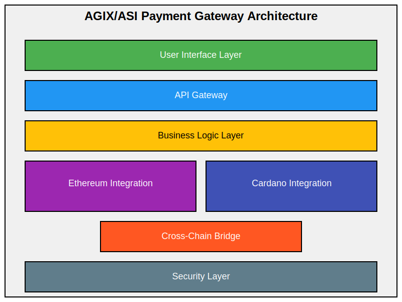

# Preliminary Technical Architecture for ASI Payment Gateway

## 1. High-Level Architecture Overview

## 2. Component Descriptions

### 2.1 User Interface Layer
- Web interface for merchants and users
- Mobile SDK for app integration
- Payment widgets for easy website integration

### 2.2 API Gateway
- RESTful APIs for developers
- WebSocket support for real-time updates
- Rate limitsing and request validation

### 2.3 Business Logic Layer
- Payment processing engine
- Currency conversion module
- Merchant management system
- Analytics and reporting module

### 2.4 Blockchain Integration Layer
#### a) Ethereum Integration
   - Smart contract interaction
   - Transaction broadcasting and monitoring
   - Gas price estimation and management

#### b) Cardano Integration
   - Native asset handling
   - Transaction construction and submission
   - Stake pool interaction for liquidity provision

### 2.5 Cross-Chain Bridge
- Atomic swap functionality
- Liquidity pool management
- Cross-chain transaction verification

### 2.6 Security Layer
- Multi-signature wallet implementation
- Encryption and key management
- Fraud detection system
- Compliance and KYC/AML checks

## 3. Data Flow Analysis

### 3.1 Payment Flow
1. User initiates payment through UI Layer
2. Request passes through API Gateway for validation
3. Business Logic Layer processes the payment request
4. Appropriate Blockchain Integration module is called
5. Transaction is constructed and signed
6. If cross-chain transfer is needed, Cross-Chain Bridge is utilized
7. Transaction is broadcasted to the respective blockchain
8. Confirmation is received and propagated back through the layers
9. User is notified of successful transaction

### 3.2 Cross-Chain Transfer Flow
1. User requests transfer from Ethereum to Cardano (or vice versa)
2. Business Logic Layer determines exchange rate and fees
3. Cross-Chain Bridge initiates atomic swap process
4. Funds are locked in a smart contract on the source chain
5. Corresponding assets are released on the destination chain
6. Confirmation is received and propagated back
7. User receives assets on the destination chain

## 4. Security Measures

### 4.1 Multi-Signature Wallets
- Implement 2-of-3 multisig for all hot wallets
- Cold storage for large amounts with 3-of-5 multisig

### 4.2 Encryption
- End-to-end encryption for all API communications
- At-rest encryption for sensitive data storage

### 4.3 Key Management
- Hardware Security Modules (HSMs) for key storage
- Strict access controls and key rotation policies

### 4.4 Fraud Detection
- AI-powered anomaly detection system
- Real-time transaction monitoring and flagging

### 4.5 Compliance
- Integrated KYC/AML checks
- Regulatory reporting module for different jurisdictions

## 5. Scalability Considerations

### 5.1 Layer 2 Solutions
- Implement Optimistic Rollups for Ethereum
- Integrate Hydra for Cardano

### 5.2 Microservices Architecture
- Break down Business Logic Layer into microservices
- Use containerization (Docker) and orchestration (Kubernetes)

### 5.3 Caching Layer
- Implement Redis for high-speed data caching
- Use CDN for static content delivery

## 6. Monitoring and Maintenance

### 6.1 Logging and Monitoring
- Centralized logging system (ELK stack)
- Real-time monitoring dashboard

### 6.2 Automated Testing and Deployment
- Continuous Integration/Continuous Deployment (CI/CD) pipeline
- Automated security scanning in the deployment process

## 7. Future Considerations

### 7.1 DeFi Integration
- Yield farming opportunities for idle funds
- Liquidity provision to decentralized exchanges

### 7.2 AI-Driven Enhancements
- Predictive analytics for fraud prevention
- Dynamic fee adjustment based on network conditions

### 7.3 Governance Model
- Implementation of a DAO for protocol upgrades
- Community voting mechanism for major decisions

---

This preliminary technical architecture provides a robust foundation for the ASI Payment Gateway. It addresses the unique challenges of supporting both Ethereum and Cardano chains while prioritizing security, scalability, and user experience. The modular design allows for easy upgrades and additions as the project evolves.

The architecture draws inspiration from BitPay's battle-tested system but extends it to support multiple chains and incorporates advanced features like cross-chain bridges and AI-driven enhancements. By implementing this architecture, the ASI Payment Gateway can position itself as a cutting-edge solution in the blockchain payment space, particularly for AI-enabled SaaS products in the SingularityNET ecosystem.