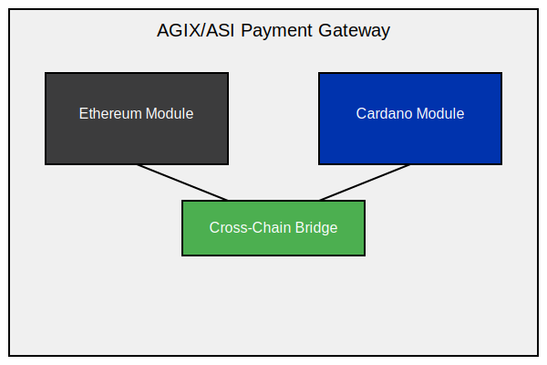
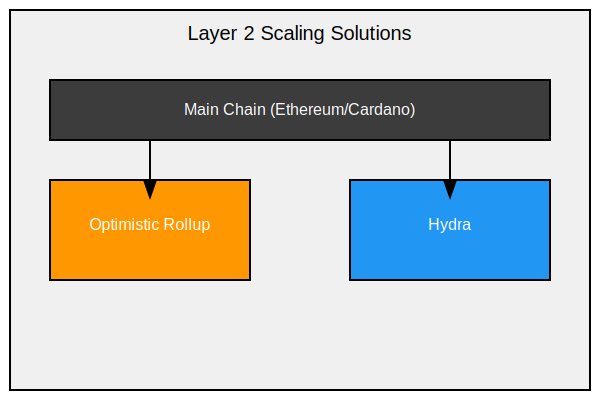
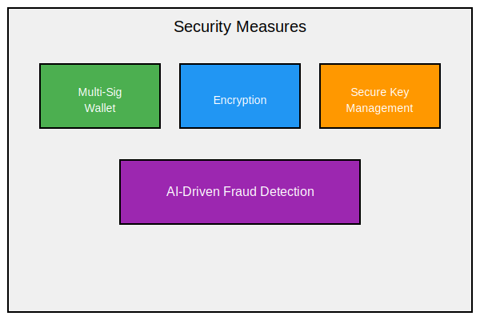

# Feasibility Study Report for ASI Payment Gateway

## Executive Summary

This report evaluates the technical and operational feasibility of implementing the ASI Payment Gateway for SingularityNET's AI-enabled SaaS products. The study assesses potential challenges, security considerations, and resource requirements. Overall, the project is deemed feasible with careful planning and execution.

### 2.1 Blockchain Integration

- **Challenge:** Support both Ethereum and Cardano blockchains to enable ASI token transactions.
- **Solution:** Create a multi-chain architecture, with dedicated modules for each blockchain, connected by a cross-chain bridge.
- **Resource Requirements:** Developers skilled in Ethereum and Cardano blockchain technologies.

### 2.2 Smart Contract Development

- **Challenge:** Build secure, efficient smart contracts to handle payments.
- **Solution:** Use formal verification methods and conduct extensive audits to ensure security.
- **Resource Requirements:** Experienced smart contract developers and security auditors.

### 2.3 Scalability

- **Challenge:** Manage high transaction volumes during peak times.
- **Solution:** Integrate Layer 2 scaling solutions like Optimistic Rollups for Ethereum and Hydra for Cardano.
- **Resource Requirements:** Blockchain scalability specialists and additional infrastructure to support Layer 2 scaling.

### 2.4 Interoperability

- **Challenge:** Enable smooth functionality across different AI services and platforms.
- **Solution:** Develop a standardized API and SDK to streamline integrations.
- **Resource Requirements:** API/SDK developers and documentation writers.

### 2.5 User Experience

- **Challenge:** Design an interface that is intuitive for both technical and non-technical users.
- **Solution:** Create user-friendly UIs with guided workflows and comprehensive documentation.
- **Resource Requirements:** UX/UI designers and technical writers.

## Security Considerations

### 3.1 Transaction Security

- **Challenge:** Safeguard user funds and transaction data.
- **Solution:** Implement multi-signature wallets, encryption, and secure key management.
- **Resource Requirements:** Experts in cryptography and security engineering.

### 3.2 Smart Contract Vulnerabilities

- **Challenge:** Protect smart contracts against potential exploits.
- **Solution:** Regular security audits, upgradeable contract mechanisms, and secure design patterns.
- **Resource Requirements:** Smart contract auditors and ongoing security monitoring.

### 3.3 Regulatory Compliance

- **Challenge:** Ensure compliance with regulations across multiple jurisdictions.
- **Solution:** Integrate KYC/AML procedures and work closely with legal experts.
- **Resource Requirements:** Legal advisors and compliance officers.

### 3.4 Fraud Prevention

- **Challenge:** Detect and prevent fraudulent activities.
- **Solution:** Deploy AI-driven fraud detection, leveraging SingularityNET’s AI.
- **Resource Requirements:** AI and ML engineers specialized in fraud detection.

## Operational Feasibility

### 4.1 Integration with Existing Systems

- **Challenge:** Ensure compatibility with SingularityNET's marketplace and services.
- **Solution:** Develop a modular structure with clear integration points and provide extensive documentation.
- **Resource Requirements:** Systems integration specialists and technical writers.

### 4.2 Maintenance and Updates

- **Challenge:** Maintain reliability and keep up with blockchain advancements.
- **Solution:** Establish a robust CI/CD pipeline and a dedicated maintenance team.
- **Resource Requirements:** DevOps engineers and ongoing developer support.

### 4.3 Customer Support

- **Challenge:** Offer effective support for a complex, technical product.
- **Solution:** Build a detailed knowledge base and implement a tiered support system.
- **Resource Requirements:** Technical support team and knowledge base contributors.

### 4.4 Performance Monitoring

- **Challenge:** Maintain performance standards and quickly respond to issues.
- **Solution:** Set up real-time monitoring and alerting systems.
- **Resource Requirements:** Reliability engineers and monitoring infrastructure.

## Resource Requirements

### 5.1 Development Team

- Blockchain developers for Ethereum and Cardano
- Smart contract engineers
- Full-stack web developers
- Mobile developers for SDK creation
- UX/UI designers
- QA engineers

### 5.2 Security Team

- Security engineers
- Smart contract auditors
- Cryptography experts

### 5.3 Operations Team

- DevOps engineers
- Reliability engineers
- Technical support staff

### 5.4 Business and Legal Team

- Product managers
- Legal advisors
- Compliance officers

### 5.5 Infrastructure

- Cloud providers (AWS, Google Cloud)
- Blockchain nodes for Ethereum and Cardano
- Layer 2 scaling infrastructure
- Monitoring and analytics tools

### 5.6 Third-party Services

- Security auditing firms
- Legal and compliance consultants
- KYC/AML service providers

## Proposed Solutions and Recommendations

### 6.1 Phased Development Approach

1. **Phase 1:** Core payment functionality on Ethereum
2. **Phase 2:** Integrate Cardano and implement a cross-chain bridge
3. **Phase 3:** Add advanced features, including DeFi integrations and AI-driven enhancements

### 6.2 Hybrid Architecture

- Use centralized components for performance combined with decentralized features for security.
- Implement Layer 2 scaling for better performance.
- Set up a cross-chain bridge to enhance interoperability.

### 6.3 Security-First Development

- Adopt security-by-design principles.
- Carry out continuous security testing and auditing.
- Launch a bug bounty program to encourage community contributions to security.

### 6.4 Regulatory Compliance Strategy

- Develop a compliance framework that adapts to multiple jurisdictions.
- Consult legal experts in key markets.
- Use privacy-preserving techniques to ensure compliance while safeguarding user privacy.

### 6.5 Community Engagement

- Involve the SingularityNET community in decision-making.
- Establish a governance model for future upgrades.
- Launch a developer advocacy program to drive adoption.

## Conclusion

The ASI Payment Gateway project is both technically and operationally feasible, although it presents substantial challenges. By capitalizing on SingularityNET’s AI and blockchain expertise and methodically addressing key obstacles, this project has a strong chance of success. The proposed phased approach and hybrid architecture will enable gradual development and minimize risk.

Key factors for success include:

- Building a skilled, multi-disciplinary team
- Ensuring security and regulatory compliance
- Focusing on user experience and developer adoption
- Utilizing SingularityNET's AI capabilities for feature enhancements

With effective planning, adequate resources, and precise execution, the ASI Payment Gateway could become a foundational element in the SingularityNET ecosystem, fostering adoption and unlocking new opportunities for AI-powered SaaS solutions.
