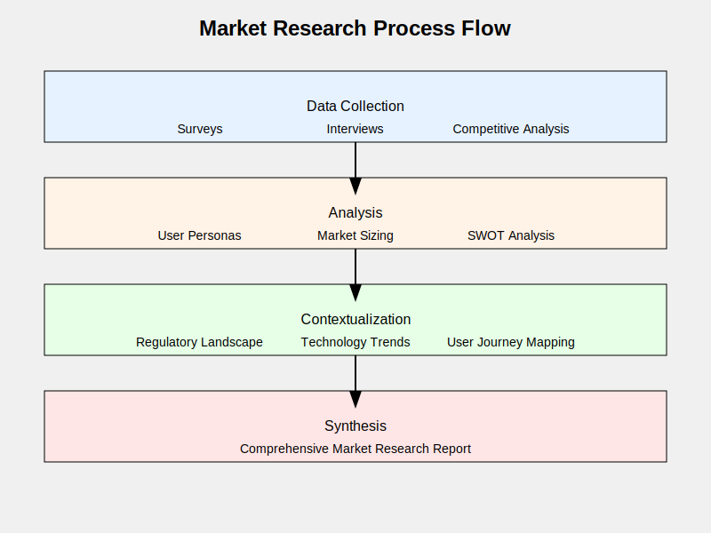

# Methodology

## ASI Payment Gateway for SaaS Products (Ideation)

Crypto payment gateways are specialized platforms that allow businesses to accept payments in cryptocurrency. They play a key role in bridging the traditional financial world with the growing crypto economy. To conduct effective market research, here are the core areas we need to examine:

## 1. Existing Solutions

- **BitPay**: One of the oldest crypto payment processors, supporting multiple types of cryptocurrency.
- **Coinbase Commerce**: Enables merchants to accept cryptocurrencies with straightforward integration.
- **CoinPayments**: Supports a wide array of cryptocurrencies and provides plugins compatible with various e-commerce platforms.
- **BTCPay Server**: A self-hosted, open-source payment processor supporting Bitcoin and other cryptocurrencies.

## 2. Key Features

- Support for multiple currencies
- Volatility protection (instant conversion to fiat)
- Compatibility with existing e-commerce platforms
- Compliance with regulatory standards
- Security features (e.g., multi-signature wallets, cold storage)
- API access for custom integrations
- Monitoring and reporting of transactions

## 3. Challenges

- Regulatory uncertainty across jurisdictions
- Price volatility of cryptocurrencies
- Speed and scalability of transactions
- User experience and education barriers
- Security risks and potential fraud

## 4. Market Trends

- Growing adoption of cryptocurrencies for payments
- Rising interest in decentralized finance (DeFi) solutions
- Increasing demand for cross-border payment options
- Integration of blockchain technology into traditional payment systems

## 5. Competitor Analysis

Analyzing existing crypto payment gateways involves examining:

- Transaction fees
- Settlement speeds
- User interface and user experience
- Integration process and supporting documentation
- Customer support services
- Security protocols
- Regulatory compliance

For the ASI Payment Gateway, our objective is to stand out in the market by specifically addressing the needs of AI-enabled SaaS products on the SingularityNET platform.

## After Market Research?

## 6. Survey Responses:
- Insights into common challenges and desired features
- Gauging the interest in using ASI tokens for payments
- Understanding the technical capabilities within our user base

## 7. In-Depth Interviews:
- One-on-one interviews with a diverse group of developers and users
- A well-structured interview guide to delve into user experiences and needs

## 8. Competitive Analysis:
- Evaluating other blockchain platforms that offer similar services
- Identifying what sets us apart in the market

## 9. User Persona Development:
- Crafting detailed profiles of our target users based on research
- Using these personas to prioritize features and inform UX design

## 10. Market Sizing:
- Estimating the potential market size for our payment gateway
- Projecting potential adoption rates and revenue opportunities

## 11. Regulatory Landscape:
- Investigating cryptocurrency regulations in key markets
- Identifying compliance requirements and potential regulatory challenges

## 12. Technology Trend Analysis:
- Staying current with emerging blockchain and cryptocurrency payment trends
- Assessing the potential impacts of these trends on our project

## 13. SWOT Analysis:
- Performing a SWOT (Strengths, Weaknesses, Opportunities, Threats) analysis for the payment gateway project

## 14. User Journey Mapping:
- Outlining the current payment process for SaaS products on our platform
- Highlighting pain points and areas for potential improvement

## 15. Benchmark Study:
- Comparing our proposed solution with existing crypto payment gateways
- Identifying opportunities to outshine competitors

## Report

This market research report is designed to be comprehensive, covering:

1. Executive Summary
2. Methodology
3. Survey Results and Analysis
4. Interview Insights
5. Competitive Landscape Analysis
6. User Personas
7. Market Size and Growth Projections
8. Regulatory Considerations
9. Technology Trend Analysis
10. SWOT Analysis
11. User Journey Maps
12. Benchmark Study Results
13. Key Findings and Recommendations
14. Appendices (raw data, detailed charts, etc.)

This report establishes a strong foundation for the next phases of the project, ensuring that the ASI payment gateway is designed to meet real-world market needs and has high potential for widespread adoption within our ecosystem.
